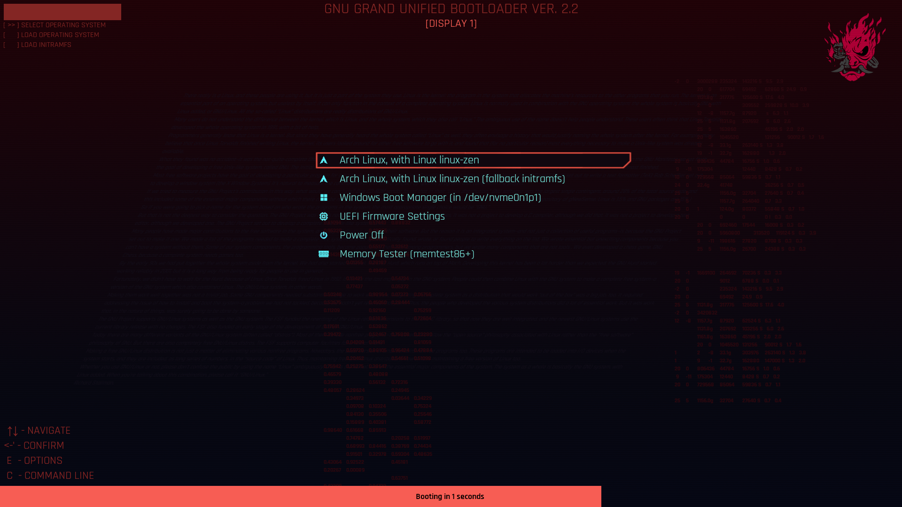
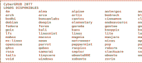

# CyberGRUB-2077



|||||||||||
|:---:|:---:|:---:|:---:|:---:|:---:|:---:|:---:|:---:|---|
|||||||||||
|||||||||||
|||||||||||
|||||||||||
|||||||||||

<a href="README.md">
    
</a>

<a href="README-es.md">
	
</a>

<a href="README-pt.md">
    
</a>

Tema de GRUB inspirado en Cyberpunk 2077.

## Instalación

1. Clona el repositorio

```shell
git clone https://github.com/adnksharp/CyberGRUB-2077
```

2. Entra en la carpeta dondes se descargó el repositorio

```shell
cd CyberGRUB-2077
```

3. Ejecuta el script de instalación como administrador

```shell
sudo $SHELL ./install.sh
```


Optionamente, puedes especificar un logo diferente usando las opciones `-L` o `--logo`:

```shell
sudo $SHELL ./install.sh -L <logo>
```

Para ver la lista de logos disponibles, ejecuta:

```shell
sudo $SHELL ./install.sh -l
```



4. Prueba tu nuevo tema
